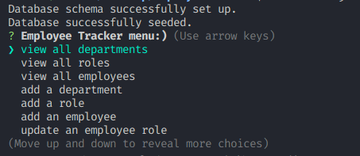
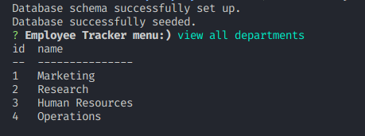
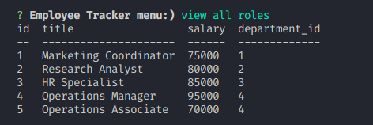
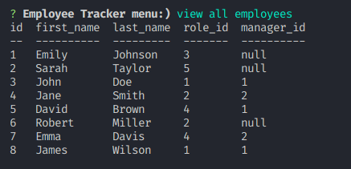
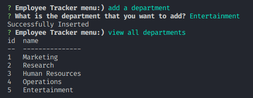
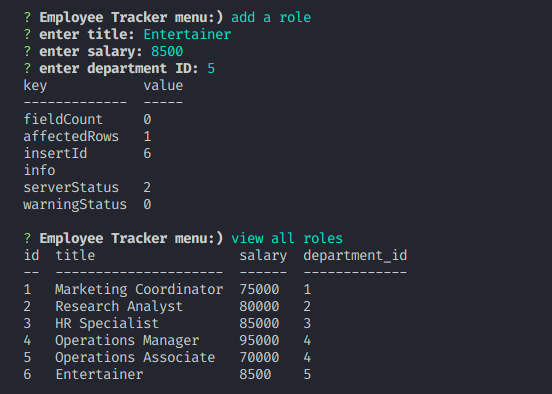
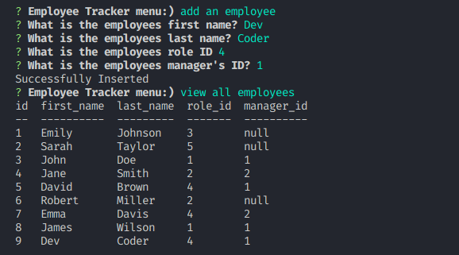
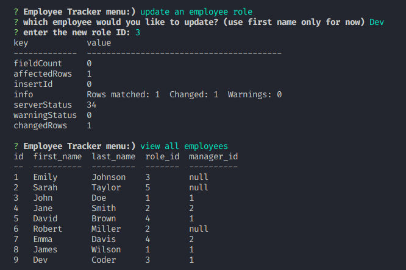

# People-N-FocUS
EMPLOYEE TRACKER
# Employee Tracker

A command-line application for managing a company's employee database. This application allows users to view and manage the departments, roles, and employees in a company. Users can view all departments, roles, or employees, add a department, role, or employee, or update an employee role. The application uses Node.js, Inquirer, and MySQL.

## User Story
```sh
AS A business owner
I WANT to be able to view and manage the departments, roles, and employees in my company
SO THAT I can organize and plan my business
```

## Acceptance Criteria
```sh
GIVEN a command-line application that accepts user input
WHEN I start the application
THEN I am presented with the following options: view all departments, view all roles, view all employees, add a department, add a role, add an employee, and update an employee role
WHEN I choose to view all departments
THEN I am presented with a formatted table showing department names and department ids
WHEN I choose to view all roles
THEN I am presented with the job title, role id, the department that role belongs to, and the salary for that role
WHEN I choose to view all employees
THEN I am presented with a formatted table showing employee data, including employee ids, first names, last names, job titles, departments, salaries, and managers that the employees report to
WHEN I choose to add a department
THEN I am prompted to enter the name of the department and that department is added to the database
WHEN I choose to add a role
THEN I am prompted to enter the name, salary, and department for the role and that role is added to the database
WHEN I choose to add an employee
THEN I am prompted to enter the employee’s first name, last name, role, and manager, and that employee is added to the database
WHEN I choose to update an employee role
THEN I am prompted to select an employee to update and their new role and this information is updated in the database
```

## Pre-requisite
Ensure that MySQL is installed and working
Use this [`link`](https://www.digitalocean.com/community/tutorials/how-to-install-mysql-on-ubuntu-20-04) to install and set your MySQL user as `root` and password as `password` to make the app run smoothly as expected

## Setup
```sh
# Install required packages
npm i

# start the app
node index.js

# or using npm
npm run start
```

## Expected Output

Menu



View All Departments



View All Roles



View All Employees



Add a Department



Add a Role



Add an Employee



Update an Employee Role



Quit

np
